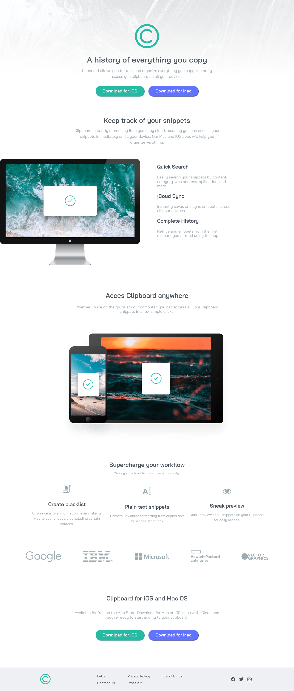

# Frontend Mentor - Solución a Clipboard landing page

Esta es una solución al [Desafío de Clipboard landing page en Frontend Mentor](https://www.frontendmentor.io/challenges/clipboard-landing-page-5cc9bccd6c4c91111378ecb9).

## Tabla de contenido

- [Visión general](#visión-general)
  - [El reto](#el-reto)
  - [Capturas de pantalla](#capturas-de-pantalla)
  - [Enlaces](#enlaces)
- [Mi proceso](#mi-proceso)
  - [Construido con](#construción)
  - [Lo que aprendi](#lo-que-aprendi)
  - [Desarrollo continuo](#desarrollo-continuo)
  - [Recursos útiles](#recursos-útiles)
- [Autor](#autor)

## Visión general

### El reto

Los usuarios deben ser capaces de:

- Ver el diseño óptimo en función del tamaño de la pantalla de su dispositivo
- Ver los estados hover de los elementos interactivos

### Capturas de pantalla

- Escritorio



- Móvil


### Enlaces

- URL de la solución (Frontend Mentor): [Solución en Frontend Mentor](https://www.frontendmentor.io/solutions/accessibility-flexbox-responsivedesign-loadinghtml-WRjKLS4kEJ)
- URL del sitio en vivo: [En vivo](https://boudgnosis.github.io/Clipboard-landing-page/)

## Mi Proceso

### Construción

- HTML semántico
- Variables CSS
- Flexbox
- Accesibilidad web
- Media queries 
- Responsive desing
- Efectos hover
- Loanding (HTML5)

### Lo que aprendi

Mi interés por ver como optimizar aunque sea un poco la página me llevo a conocer el atributo **loading** que permite
cargar las imágenes según sea tu interés, hay tres posibilidades, **eager**: te carga la imagen de forma prioritaria, **lazy**: cuando se espera que cargue de forma diferida y **auto** que es cuando el navegador determina cuál es la mejor opción.

```html

```

### Recursos útiles

- [MDN Web Docs](https://developer.mozilla.org/es/) - Suelo usar este recurso porque explica muy bien todo además de que tiene una documentación muy amplia.
- [midudev](https://midu.dev/lazy-loading-imagenes-html/) - En este blog encontre la información de **loading**, esta muy bien explicada y ademas hay muchas más publicaciones sobre front-end

## Autor

- Codepen - [@boudgnosis](https://codepen.io/boudgnosis)
- Frontend Mentor - [@boudgnosis](https://www.frontendmentor.io/profile/boudgnosis)
- Twitter - [@juan_ariasd](https://twitter.com/juan_ariasd)   
- Dev - [@juan_duque](https://dev.to/juan_duque)
- Linkedink - [juan pablo arias duque](https://www.linkedin.com/in/jpariasduque/)
